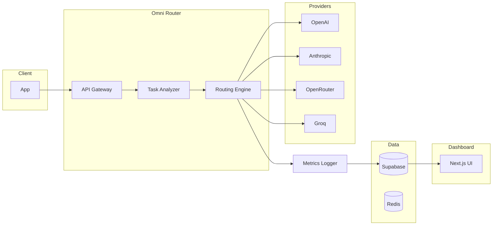

# Omni-Model Router — Architecture

High-level architecture for the MVP. For implementation details, schema, and API contracts see [plan.md](../plan.md) and [API.md](API.md).

---

## System diagram

---

## Components

**Client (App)** — Any caller (app, agent, or tool) that sends requests to the router. Uses a single API endpoint; no provider-specific integration.

**API Gateway** — Entry point for the Omni Router. Authenticates the request (API key), validates payload, and forwards to the Task Analyzer. Returns the final response to the client and handles errors and rate limits.

**Task Analyzer** — Classifies each request (e.g. chat, coding, reasoning, summarization, translation, image, agent_step) using a lightweight model or heuristic. Output is used by the Routing Engine to pick the best model.

**Routing Engine** — Consults the model registry and request context (task type, priority, latency preference, max cost). Selects the best model (rule-based in MVP; later scoring). Calls the chosen provider adapter and implements fallback on failure.

**Providers (OpenAI, Anthropic, OpenRouter, Groq)** — External model APIs. The router uses adapters so provider-specific details (auth, request shape, response parsing) stay in one place.

**Metrics Logger** — Records each request: model used, tokens, cost, latency, success/failure. Writes to the database for analytics and savings calculation. Does not block the response path.

**Database (Supabase)** — Stores users/orgs, API keys, model registry, request logs, and routing logs. Source of truth for usage and cost.

**Redis (Upstash)** — Optional cache for model registry or rate-limit counters to keep routing fast.

**Dashboard (Next.js UI)** — Reads from the database to show overview, usage over time, model breakdown, and savings. No direct coupling to the router API beyond shared DB.
