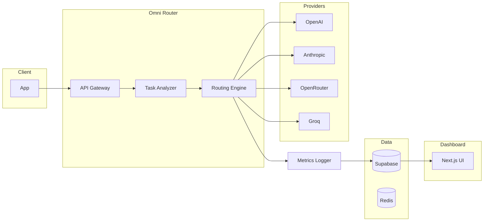

# Omni-Model Router — MVP Technical Plan

- [ ] Goal: Build a production-ready MVP: one API that receives AI requests, detects task type, routes to the optimal model, tracks cost and latency, and shows savings in a dashboard.
- [ ] Timeline: ~30–45 days.
- [ ] Positioning: The most efficient API for AI (see [IDEA.md](IDEA.md) in docs/).

**Progress legend:** `[ ] Not started` `[-] In progress` `[x] Done` `[~] Blocked`

---

## 1. MVP objective

- [x] Deliver a single API that receives AI requests.
- [x] Detects task type.
- [x] Routes to the best model (cost, latency, task fit).
- [x] Tracks cost and latency.
- [x] Surfaces savings in a dashboard.
- [x] Success: automatic routing, real cost reduction, reliable fallback, clear analytics. If it saves money, it sells.

---

## 2. High-level architecture

- [x] See [docs/ARCHITECTURE.md](docs/ARCHITECTURE.md) for component details.
- [x] Contract: [docs/API.md](docs/API.md).



- [x] Request flow: Client → API Gateway → Task Analyzer → Routing Engine → Model Provider → Metrics Logger → Database → (optional) Dashboard.

---

## 3. Tech stack

| Layer | Choice | Status |
|-------|--------|--------|
| Backend | Node.js, TypeScript, Fastify | [x] |
| Database | Supabase (Postgres) | [x] |
| Cache | Redis (Upstash) for rate limits (optional) | [x] |
| Hosting | Vercel (API + dashboard); optional Fly.io for router | [ ] |
| Dashboard | Next.js, Tailwind, chart library | [x] |
| MVP providers | OpenAI, Anthropic, OpenRouter, Groq | [x] |

---

## 4. Environment and config

- [ ] Required env / secrets (no defaults in repo):

| Variable | Purpose | Status |
|----------|---------|--------|
| `SUPABASE_URL` | Postgres + auth | [x] |
| `SUPABASE_SERVICE_KEY` | Server-side DB/auth | [x] |
| `OPENAI_API_KEY` | OpenAI | [x] |
| `ANTHROPIC_API_KEY` | Anthropic | [x] |
| `OPENROUTER_API_KEY` | OpenRouter | [x] |
| `GROQ_API_KEY` | Groq (optional) | [x] |
| `UPSTASH_REDIS_REST_URL` | Redis REST URL | [x] |
| `UPSTASH_REDIS_REST_TOKEN` | Redis token | [x] |
| `RATE_LIMIT_MAX` | Requests allowed per window | [x] |
| `RATE_LIMIT_WINDOW_SEC` | Rate limit window in seconds | [x] |

- [x] All secrets from env; no hardcoded keys.

---

## 5. Folder structure

- [x] Target structure:

```
OMNI MODEL/
├── README.md
├── IDEA.md
├── plan.md
├── docs/
│   ├── ARCHITECTURE.md
│   ├── API.md
│   └── AGENTS.md
├── apps/
│   ├── api/           # Fastify router API
│   └── dashboard/     # Next.js analytics
└── packages/
    └── shared/        # Shared types, constants (optional)
```

---

## 6. Core features

### 6.1 Universal API — POST `/v1/chat`

- [x] Request: `messages`, optional `priority` (`"cheap"` | `"balanced"` | `"best"`), `latency_pref` (`"fast"` | `"normal"`), `max_cost`.
- [x] Response: `output`, `model_used`, `cost`, `latency_ms`, `savings_estimate`.
- [x] See [docs/API.md](docs/API.md) for full contract.

### 6.2 Model registry

- [x] Table `models` drives routing.
- [x] Fields: `id` (uuid), `provider`, `model_name`, `cost_input`, `cost_output` (decimal), `avg_latency` (int ms), `strengths` (jsonb, e.g. `["chat","coding"]`), `supports_functions`, `supports_vision`, `max_tokens`, timestamps (timestamptz).

### 6.3 Task detection (MVP)

- [x] Use a cheap model to classify each request.
- [x] Types: `chat`, `coding`, `reasoning`, `summarization`, `translation`, `image`, `agent_step`.
- [x] Store result for routing.

### 6.4 Routing engine (MVP: rule-based)

- [x] By task: e.g. coding → code model, reasoning → reasoning model.
- [x] By preference: `priority === "cheap"` → cheapest; `latency_pref === "fast"` → fastest.
- [x] Scoring (when moving beyond pure rules):

```
score = w1 * (1 - cost_normalized) + w2 * (1 - latency_normalized) + w3 * task_match_score
```

- [x] Default weights configurable (e.g. cost 0.4, latency 0.3, task 0.3). Pick model with highest score.

### 6.5 Fallback

- [x] Try primary model → on failure try backup → then cheapest fallback. Automatic; no client change.

### 6.6 Cost and usage tracking

- [x] Per request: store `model_used`, tokens, cost (decimal), latency_ms, success/fail.
- [x] Compute: estimated cost if premium model had been used, actual cost, savings.
- [x] Return `savings_estimate` in response; persist for dashboard.

### 6.7 Analytics dashboard

- [x] Pages: Overview (total requests, cost, savings), Usage (over time), Model breakdown.
- [x] Show which models were used, routing impact, and savings.
- [x] Frontend redesign (visual system, layout, panels).
- [x] Date range filters wired to `/v1/usage` (`from`, `to`).

---

## 7. Database schema (with types)

| Table | Key columns and types | Status |
|-------|------------------------|--------|
| **users** | `id` uuid, `org_id` uuid, `email` text, `api_key` text (hashed), timestamptz | [x] |
| **orgs** | `id` uuid, `name` text, `billing_plan` text, timestamptz | [x] |
| **models** | `id` uuid, `provider` text, `model_name` text, `cost_input` decimal, `cost_output` decimal, `avg_latency` int, `strengths` jsonb, `supports_functions` bool, `supports_vision` bool, `max_tokens` int, timestamptz | [x] |
| **requests** | `id` uuid, `org_id` uuid, `task_type` text, `model_used` text, `tokens` int, `tokens_input` int, `tokens_output` int, `cost` decimal, `latency_ms` int, `success` bool, `created_at` timestamptz | [x] |
| **routing_logs** | `id` uuid, `request_id` uuid, `considered_models` jsonb, `final_model` text, `reason` text, timestamptz | [x] |

---

## 8. Auth flow

1. [x] Client sends request with API key (e.g. `Authorization: Bearer <api_key>` or `X-API-Key`).
2. [x] Look up key in `users` (or dedicated api_keys table); resolve `org_id`.
3. [x] Attach `org_id` to request context for logging and rate limits.
4. [x] Reject if invalid or missing. (JWT can be added later if needed.)

---

## 9. API endpoints

| Method | Path | Purpose | Status |
|--------|------|---------|--------|
| GET | `/health` | Liveness | [x] |
| GET | `/ready` | Readiness (DB connectivity) | [x] |
| POST | `/v1/chat` | Main routing endpoint | [x] |
| POST | `/v1/agent-step` | Agent workflow steps | [x] |
| GET | `/v1/usage` | Cost/usage stats | [x] |
| GET | `/v1/models` | Available models | [x] |
| POST | `/v1/router/debug` | Explain routing decision | [x] |

- [x] See [docs/API.md](docs/API.md) for request/response shapes and error format.

---

## 10. Cost optimization and savings

- [x] Compute **actual cost** (from provider + model pricing).
- [x] Compute **estimated cost** if a default premium model had been used.
- [x] **Savings** = premium estimate − actual cost.
- [x] Return `savings_estimate` (and optionally `estimated_savings` in body) so clients and dashboard can show “You saved $X.”

---

## 11. Security (MVP)

- [x] API keys per org (or user); no keys in logs.
- [x] Rate limiting (e.g. 100 req/min per org; Upstash or in-memory fallback).
- [x] All secrets in env; basic request logging for debugging.
- [x] No enterprise compliance (SSO, audit logs, etc.) in MVP.

---

## 12. First models (MVP)

| Role | Example model | Task fit | Status |
|------|----------------|----------|--------|
| Cheap chat | OpenAI gpt-4o-mini or Anthropic claude-3-haiku | chat, simple summarization | [x] |
| Reasoning | OpenAI gpt-4o or Anthropic claude-3-sonnet | reasoning, complex analysis | [x] |
| Coding | OpenRouter or Groq coding model | coding | [x] |
| Fallback | Cheapest stable model | when primary/backup fail | [x] |

- [x] Enough for MVP; extend via `models` table.

---

## 13. MVP differentiation

- [x] **Savings estimator** — Show “You saved $X this month” in dashboard and in response.
- [x] **Agent mode** — `/v1/agent-step` routes each step separately.
- [x] **Debug routing** — `/v1/router/debug` explains why a model was chosen.

---

## 14. Implementation roadmap (dependency-ordered)

- [x] Build order for agents: see [docs/AGENTS.md](docs/AGENTS.md).
- [x] Week 1: Project setup, DB schema, connect one provider, manual routing (no task detection).
- [x] Week 2: Task classifier, routing engine, fallback chain.
- [x] Week 3: Cost tracking, request logging, dashboard UI (overview, usage, model breakdown).
- [-] Week 4: Polish, deploy (Vercel + Supabase + Upstash), first beta users.

---

## 15. Deployment

- [ ] **API + dashboard:** Vercel (dashboard); API as long-running on Fly.io / Railway / VPS.
- [ ] **DB:** Supabase (migrations in repo; run in SQL editor).
- [ ] **Redis:** Upstash (optional; in-memory fallback when not set).
- [x] **CORS:** `CORS_ORIGIN` env for dashboard origin.
- [x] **Docs:** README Deployment section; dashboard `vercel.json`.
- [ ] Add logging and basic monitoring.

---

## 16. Post-MVP (do not build yet)

- [ ] ML-based routing.
- [ ] A/B testing of models.
- [ ] Enterprise controls (SSO, audit).
- [ ] Full benchmarking engine.
- [ ] Response caching.
- [ ] Focus MVP on core routing and demonstrable savings.

---

## 17. Success metrics

- [ ] **Cost:** 20%+ reduction vs always using a premium model.
- [ ] **Latency:** <500 ms routing overhead.
- [ ] **Reliability:** Fallback works when primary fails.
- [ ] **Adoption:** 3–5 beta users.

---

## 18. Critical build order (system correctness)

1. [x] Schema + migrations stability.
2. [x] Auth + org scoping.
3. [x] Multi-provider adapters.
4. [x] Routing logic + fallback.
5. [x] Accurate cost + token accounting.
6. [x] Usage analytics integrity (`/v1/usage`).
7. [x] Rate limiting + abuse protection.
8. [x] Monitoring + error visibility (request_id, error shape, GET /ready).
9. [x] Deployment hardening (CORS, deploy docs, Vercel config; deploy steps in README).
