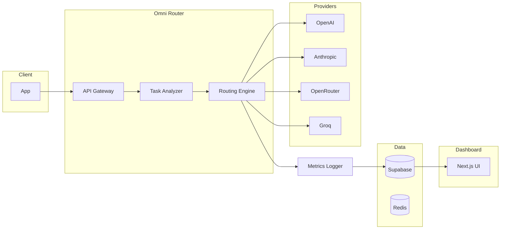

# Omni-Model Router — MVP Technical Plan

**Goal:** Build a production-ready MVP: one API that receives AI requests, detects task type, routes to the optimal model, tracks cost and latency, and shows savings in a dashboard.

**Timeline:** ~30–45 days. **Positioning:** The most efficient API for AI (see [IDEA.md](IDEA.md)).

---

## 1. MVP objective

Deliver a single API that:

- Receives AI requests
- Detects task type
- Routes to the best model (cost, latency, task fit)
- Tracks cost and latency
- Surfaces savings in a dashboard

**Success =** automatic routing, real cost reduction, reliable fallback, clear analytics. If it saves money, it sells.

---

## 2. High-level architecture

See [docs/ARCHITECTURE.md](docs/ARCHITECTURE.md) for component details. Contract: [docs/API.md](docs/API.md).



**Request flow:** Client → API Gateway → Task Analyzer → Routing Engine → Model Provider → Metrics Logger → Database → (optional) Dashboard.

---

## 3. Tech stack

| Layer | Choice |
|-------|--------|
| Backend | Node.js, TypeScript, Fastify |
| Database | Supabase (Postgres) |
| Cache | Redis (Upstash) |
| Hosting | Vercel (API + dashboard); optional Fly.io for router |
| Dashboard | Next.js, Tailwind, chart library |
| MVP providers | OpenAI, Anthropic, OpenRouter, Groq |

---

## 4. Environment and config

Required env / secrets (no defaults in repo):

| Variable | Purpose |
|----------|---------|
| `SUPABASE_URL` | Postgres + auth |
| `SUPABASE_SERVICE_KEY` | Server-side DB/auth |
| `OPENAI_API_KEY` | OpenAI |
| `ANTHROPIC_API_KEY` | Anthropic |
| `OPENROUTER_API_KEY` | OpenRouter |
| `GROQ_API_KEY` | Groq (optional) |
| `UPSTASH_REDIS_REST_URL` | Redis REST URL |
| `UPSTASH_REDIS_REST_TOKEN` | Redis token |
| `API_KEY_VERIFICATION` | e.g. Supabase or custom API key lookup |

All secrets from env; no hardcoded keys.

---

## 5. Folder structure

```
OMNI MODEL/
├── README.md
├── IDEA.md
├── plan.md
├── docs/
│   ├── ARCHITECTURE.md
│   ├── API.md
│   └── AGENTS.md
├── apps/
│   ├── api/           # Fastify router API
│   └── dashboard/     # Next.js analytics
└── packages/
    └── shared/        # Shared types, constants (optional)
```

---

## 6. Core features

### 6.1 Universal API — POST `/v1/chat`

Request: `messages`, optional `priority` (`"cheap"` | `"balanced"` | `"best"`), `latency_pref` (`"fast"` | `"normal"`), `max_cost`.  
Response: `output`, `model_used`, `cost`, `latency_ms`, `savings_estimate`.  
See [docs/API.md](docs/API.md) for full contract.

### 6.2 Model registry

Table `models` drives routing. Fields: `id` (uuid), `provider`, `model_name`, `cost_input`, `cost_output` (decimal), `avg_latency` (int ms), `strengths` (jsonb, e.g. `["chat","coding"]`), `supports_functions`, `supports_vision`, `max_tokens`, timestamps (timestamptz).

### 6.3 Task detection (MVP)

Use a cheap model to classify each request. Types: `chat`, `coding`, `reasoning`, `summarization`, `translation`, `image`, `agent_step`. Store result for routing.

### 6.4 Routing engine (MVP: rule-based)

- By task: e.g. coding → code model, reasoning → reasoning model.
- By preference: `priority === "cheap"` → cheapest; `latency_pref === "fast"` → fastest.
- Scoring (when moving beyond pure rules):  
  `score = w1 * (1 - cost_normalized) + w2 * (1 - latency_normalized) + w3 * task_match_score`  
  Default weights configurable (e.g. cost 0.4, latency 0.3, task 0.3). Pick model with highest score.

### 6.5 Fallback

Try primary model → on failure try backup → then cheapest fallback. Automatic; no client change.

### 6.6 Cost and usage tracking

Per request: store `model_used`, tokens, cost (decimal), latency_ms, success/fail. Compute: estimated cost if premium model had been used, actual cost, savings. Return `savings_estimate` in response; persist for dashboard.

### 6.7 Analytics dashboard

Pages: Overview (total requests, cost, savings), Usage (over time), Model breakdown. Show which models were used, routing impact, and savings.

---

## 7. Database schema (with types)

| Table | Key columns and types |
|-------|------------------------|
| **users** | `id` uuid, `org_id` uuid, `email` text, `api_key` text (hashed), timestamptz |
| **orgs** | `id` uuid, `name` text, `billing_plan` text, timestamptz |
| **models** | `id` uuid, `provider` text, `model_name` text, `cost_input` decimal, `cost_output` decimal, `avg_latency` int, `strengths` jsonb, `supports_functions` bool, `supports_vision` bool, `max_tokens` int, timestamptz |
| **requests** | `id` uuid, `org_id` uuid, `task_type` text, `model_used` text, `tokens` int, `cost` decimal, `latency_ms` int, `success` bool, `created_at` timestamptz |
| **routing_logs** | `id` uuid, `request_id` uuid, `considered_models` jsonb, `final_model` text, `reason` text, timestamptz |

---

## 8. Auth flow

1. Client sends request with API key (e.g. `Authorization: Bearer <api_key>` or `X-API-Key`).
2. Look up key in `users` (or dedicated api_keys table); resolve `org_id`.
3. Attach `org_id` to request context for logging and rate limits.
4. Reject if invalid or missing. (JWT can be added later if needed.)

---

## 9. API endpoints

| Method | Path | Purpose |
|--------|------|---------|
| POST | `/v1/chat` | Main routing endpoint |
| POST | `/v1/agent-step` | Agent workflow steps |
| GET | `/v1/usage` | Cost/usage stats |
| GET | `/v1/models` | Available models |
| POST | `/v1/router/debug` | Explain routing decision |

See [docs/API.md](docs/API.md) for request/response shapes and error format.

---

## 10. Cost optimization and savings

For each request:

- Compute **actual cost** (from provider + model pricing).
- Compute **estimated cost** if a default premium model had been used.
- **Savings** = premium estimate − actual cost.
- Return `savings_estimate` (and optionally `estimated_savings` in body) so clients and dashboard can show “You saved $X.”

---

## 11. Security (MVP)

- API keys per org (or user); no keys in logs.
- Rate limiting (e.g. 100 req/min per org; exact limits TBD).
- All secrets in env; basic request logging for debugging.

No enterprise compliance (SSO, audit logs, etc.) in MVP.

---

## 12. First models (MVP)

| Role | Example model | Task fit |
|------|----------------|----------|
| Cheap chat | OpenAI gpt-4o-mini or Anthropic claude-3-haiku | chat, simple summarization |
| Reasoning | OpenAI gpt-4o or Anthropic claude-3-sonnet | reasoning, complex analysis |
| Coding | OpenRouter or Groq coding model | coding |
| Fallback | Cheapest stable model | when primary/backup fail |

Enough for MVP; extend via `models` table.

---

## 13. MVP differentiation

- **Savings estimator** — Show “You saved $X this month” in dashboard and in response.
- **Agent mode** — `/v1/agent-step` routes each step separately.
- **Debug routing** — `/v1/router/debug` explains why a model was chosen.

---

## 14. Implementation roadmap (dependency-ordered)

Build order for agents: see [docs/AGENTS.md](docs/AGENTS.md). High level:

1. **Week 1:** Project setup, DB schema, connect one provider, manual routing (no task detection).
2. **Week 2:** Task classifier, routing engine, fallback chain.
3. **Week 3:** Cost tracking, request logging, dashboard UI (overview, usage, model breakdown).
4. **Week 4:** Polish, deploy (Vercel + Supabase + Upstash), first beta users.

---

## 15. Deployment

- **API + dashboard:** Vercel
- **DB:** Supabase
- **Redis:** Upstash
- **Optional:** Fly.io for router if needed
- Add logging and basic monitoring

---

## 16. Post-MVP (do not build yet)

- ML-based routing
- A/B testing of models
- Enterprise controls (SSO, audit)
- Full benchmarking engine
- Response caching

Focus MVP on core routing and demonstrable savings.

---

## 17. Success metrics

- **Cost:** 20%+ reduction vs always using a premium model.
- **Latency:** &lt;500 ms routing overhead.
- **Reliability:** Fallback works when primary fails.
- **Adoption:** 3–5 beta users.
